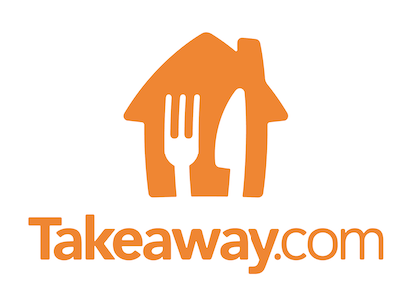

# Project Persistence
   

### Takeaway
JustEat Takeaway.com is a leading online food ordering platform, focused on connecting consumers and restaurants through its platform in over 12 countries. JustEat Takeaway.com offers an online platform where supply and demand for food delivery and ordering come together.
The company started operations in 2000 when its CEO, Jitse Groen, founded and launched one of the world's first online food ordering platforms, Thuisbezorgd.nl, in the Netherlands.

### Project group (members)   

| Name | Date of birth | e-Mail |
| ------ | ------ |------ |
| Lucia Pusova | 08 - 12 - 1991 | 474237@student.saxion.nl  |
| Max Sterken | 18 - 05 - 1994 | 485736@student.saxion.nl   |
| Sem Nijenhuis | 08 - 06 - 1998 | 470066@student.saxion.nl   |
| Stephen Nedd | 21 - 06 - 1995 | 484629@student.saxion.nl  |

Introduction

## Descriptions

Takeaway would like us to bring these drivers closer to the customers by means of a text chat based application that we are going to build.

Couriers would like to message the customer directly to receive additional directions in order to deliver the order. In addition to the courier app, customers would need a means to chat with the courier as well. A simple chat interface for clients would do, keeping the focus on the courier app.

### Persistence Description
Project persistance is meant to teach us how to store data in a real world scenario. The app we are creating is dependant on some form of database 
in order to store and load information about users and orders. That is the main goal of project persistance, to learn how to make an app from front
end to back end for the android platform.

### Short description of customer (the company, not the supervisor)
10 lines
Contact info and roles of the customer
Agreements with customer about general communication

### General project description 
The goal of this project is to develop an app for Takeaway.com to their set specifications. The app that will be developed is a courier-client messaging app, with the main functionality of the app being a messaging system that communicates the clients of Takeaway.com to their couriers. The app will be developed and tested for the android platform. Using a backend and front end written in the Java programming language. The database that was chosen for this application is the PostgreSQL database. The user interface design will be created using mostly Adobe Xd, and will be designed following the specifications in the Takeaway.com visual identity as closely as possible.
 
### Scrum organisation

| Sprint | Scrum master |
| ------ | ------ |
| 1 | Max Sterken |
| 2 | Sem Nijenhuis |
| 3 | Lucia Pusova |

Stephen Nedd is our contact person

Project agreements
* Roles, and specialisations
* Documentation agreements
* Organisation    
* Working agreements (including measures/escalations)

Expected project result 
(inc mile stones)

## Testing

## Communication
WhatsApp
Microsoft Teams
Collaborate

### Testing methods
* User testing
* UX 
* Tech testing

### Bug / issue log
* Bug fixing procedures

Ideally testing should be part of the project description and the way you handle your scrum sessions. And yes… this is a very obvious hint….

### Product backlog (prioritised)
| Priority | Issue  |
| ------ | ------ |
1|Design Front-End|
1|Set up Databas|
2|Display delivery-time|
1|View Order details|
1|Send Messages|
1|Login functionality|
1|Refresh Orders|
2|Cache Messages|
3|Online status of user|
3|Close Orders|
